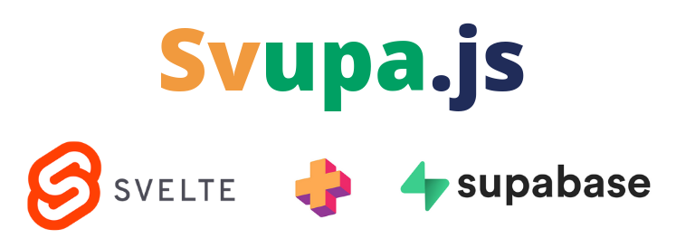

<a href="https://svupa.vercel.app/">

</a>

Svupa is a [Svelte](https://svelte.dev/) + [Supabase](https://supabase.com/) framework to create realtime apps with a single source of truth and optimistic updates.

Using Svupa, Supabase can serve as a Single Source of Truth for your data.
Every event (insert, update or delete) is directly streamed to the client, where a Svelte store is updated accordingly and the User Interface relfects the changes.
Additionally, Svupa offers an optimistic update mode, making your user interface more responsive.

Features
- [x] Realtime UI updates across all affected clients
- [x] Single Source of Truth
- [x] Optional Optimistic Updates
- [x] Application-wide Data-Caching
- [x] No Polling
- [x] Conflic Resolution
- [x] Simple Usage
- [x] As scalable as Supabase
- [x] Minimal Footprint
- [x] Open-Source

Read much more about it on the project webiste: https://svupa.vercel.app/
